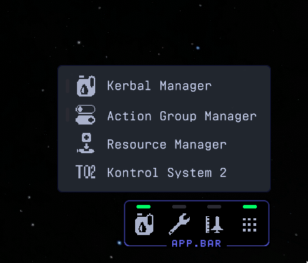
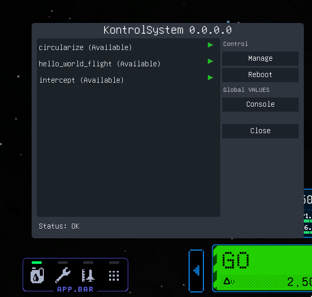
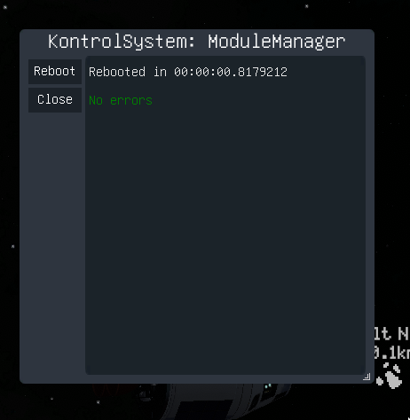
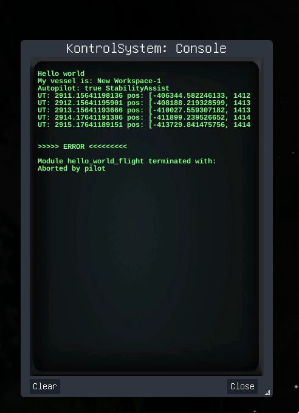

# Kontrol System 2

A scripting framework for autopilots in Kerbal Space Program 2.

This is the successor of [KontrolSystem](https://github.com/untoldwind/KontrolSystem) which in turn was (supposed to be) the spiritual offspring of the wonderful [KOS](https://github.com/KSP-KOS/KOS) mod.

[Documentation](https://kontrolsystem2.readthedocs.io)

## Installation

* Install [BepInEx](https://github.com/BepInEx/BepInEx) and [SpaceWarp](https://github.com/SpaceWarpDev/SpaceWarp) v0.4.0
  * ... or just SpaceWarp with bundled BepInEx
* Unpack the one of the [releases](https://github.com/untoldwind/KontrolSystem2/releases) in the same directory as the KSP2 executable
  * Directory should look like:
    ```
    KSP2_x64.exe
    BepInEx
    |- plugins
    |  |- KontrolSystem2
    |  |  |- KontrolSystemSpaceWarpMod.dll
    |  |  |- ...
    |  |- SpaceWarp
    |  |- ...
    |- ...
    ```

In flight there should now be an additional menu entry:



which should open the main dialog to start scripts:



The "Manage" button shows all errors if the system failed to reboot. If everything is ok it should be like this:



And there is a console where scripts can write helpful (or not so helpful) stuff to:



... obviously this whole thing is every basic at the moment

## Building

Currently there is a hard requirment to [BepInEx](https://github.com/BepInEx/BepInEx) and [SpaceWarp](https://github.com/SpaceWarpDev/SpaceWarp). Both need to be installed to your local copy of KSP2.

If KSP2 is installed somewhere else than `C:\Program Files (x86)\Steam\steamapps\common\Kerbal Space Program 2` you have to set a `KSP2_BASE_DIR` environment variable with the correct path (or somehow set this as a global property for `msbuild`).

Convenient build scripts: `build.ps1` (Windows), `build.sh` (Linux)

## Known issues

* The calculated maneuver nodes are slightly of from the expected result
  * ... since the game does a more precise brun simulation
  * This requires some careful examination of all the numbers
* When running the script with the map-view opened the gizmo does not appear
  * ... most likely the current way of adding maneuvering nodes is not how it is supposed to be done
  * Can be mitigated by switch from map to flight and back again

## Missing parts aka. "soon"(tm)

* Lots of documentation
* Better support of vessel steering, throttle etc.
