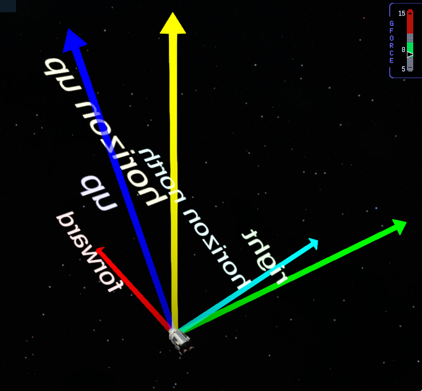
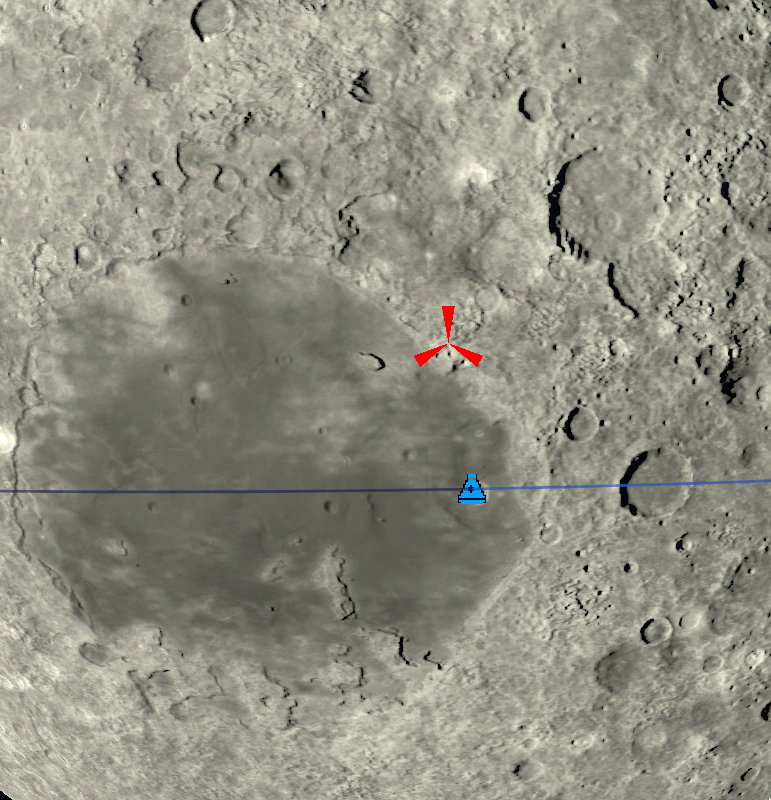

# Debug vectors and ground markers

## Debug vectors

Debug vectors are back, i.e. point lines you can draw in the game world to figure out what is wrong with the autopilot you are working on.

Here is a little example script:
```rust
use { Vessel } from ksp::vessel
use { CONSOLE, RED, BLUE, YELLOW, GREEN, CYAN } from ksp::console
use { DEBUG } from ksp::debug
use { sleep } from ksp::game

pub fn main_flight(vessel: Vessel) -> Result<Unit, string> = {
    let forward = DEBUG.add_vector(fn() -> vessel.global_position, fn() -> vessel.global_facing.vector * 50, RED, "forward", 1)
    let up = DEBUG.add_vector(fn() -> vessel.global_position, fn() -> vessel.global_facing.up_vector * 50, BLUE, "up", 1)
    let right = DEBUG.add_vector(fn() -> vessel.global_position, fn() -> vessel.global_facing.right_vector * 50, GREEN, "right", 1)
    let horizon_up = DEBUG.add_vector(fn() -> vessel.global_position, fn() -> vessel.global_up * 50, YELLOW, "horizon up", 1)
    let horizon_north = DEBUG.add_vector(fn() -> vessel.global_position, fn() -> vessel.global_north * 50, CYAN, "horizon north", 1)

    sleep(30)
}
```

will produce something like this: 

If you make them long enough (e.g. multiply with `5000` instead of `50`) they will be visible on the map view as well.

## Ground markers

Ground markers are nice to visualize a `GeoPosition`:

```
use { Vessel } from ksp::vessel
use { CONSOLE, RED, BLUE, YELLOW, GREEN, CYAN } from ksp::console
use { DEBUG } from ksp::debug
use { sleep } from ksp::game

pub fn main_flight(vessel: Vessel) -> Result<Unit, string> = {
    let ground = DEBUG.add_ground_marker(vessel.geo_coordinates, RED, 0)

    sleep(30)
}
```
will mark the point on the ground where the vessel currently is: .
This is visible in the map view and also in the flight view if you are close to the ground