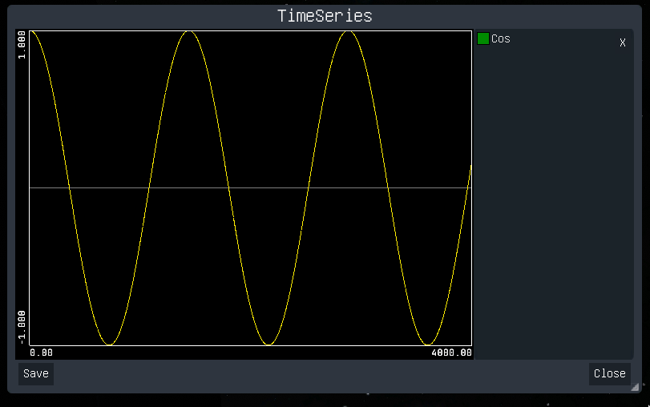

# Collecting telemetry data

The [`ksp::telemetry`](../reference/ksp/telemetry.md) module offers the ability to collect arbitrary telemetry data in form of [`TimeSeries`](../reference/ksp/telemetry.md#timeseries).

A `TimeSeries` can be used to record the changes of a values over a span of time. To limit the amount of memory a time series as a minimum time resolution, i.e. the interval of `start_ut` to `end_ut` is split into a limited amount of buckets (at the moment the number of buckets can not exceed 5000).
Additionally overall number of time series that can be held in memory is limited to 20.

## Simple example

The following example demonstrates how a time series can be created in a script:

```rust
use { Vessel } from ksp::vessel
use { CONSOLE } from ksp::console
use { add_time_series } from ksp::telemetry
use { cos_deg } from core::math

pub fn main_flight( vessel: Vessel) -> Result<Unit, string> = {
    let cos = add_time_series("Cos", 0, 0.1)
    for(i in 0..20000) {
        cos.add_data(i * 0.2, cos_deg(i / 20.0))
    }
}
```

* With the `add_time_series` function a new time series "Cos" is created with a start time of `0` and an initial time resolution of `0.1`.
* Then values are added using the `add_data` method on the time series.

Which will then crate something like this.




## More useful example

The following example is a script records the altitude, mass, pitch, horizontal surface speed and orbit apoapsis of the current vessel until it is terminated:

```rust
use { Vessel } from ksp::vessel
use { CONSOLE } from ksp::console
use { current_time, sleep } from ksp::game
use { add_time_series } from ksp::telemetry

pub fn main_flight( vessel: Vessel) -> Result<Unit, string> = {
    let ut = current_time()
    let altitude = add_time_series("Altitude", ut, 0.1)
    let mass = add_time_series("Mass", ut, 0.1)
    let pitch = add_time_series("Pitch", ut, 0.1)
    let surface_velocity = add_time_series("Surface velcoty", ut, 0.1)
    let horizonal_surface_speed = add_time_series("Horizonal Srf Speed", ut, 0.1)
    let apoapsis = add_time_series("Apoapsis", ut, 0.1)

    while(true) {
        ut = current_time()
        altitude.add_data(ut, vessel.altitude_sealevel)
        mass.add_data(ut, vessel.mass)
        pitch.add_data(ut, vessel.pitch_yaw_roll.x)
        surface_velocity.add_data(ut, vessel.surface_velocity.magnitude)
        horizonal_surface_speed.add_data(ut, vessel.horizontal_surface_speed)
        apoapsis.add_data(ut, vessel.orbit.apoapsis | 0)

        sleep(0.2)
    }
}
```

As it does not interfered with the steering at all, it can run in parallel to any start or landing script.

## Storing the data

The data of all time series can be saved to a json file either via the UI or by using the [`save_time_series`](../reference/ksp/telemetry.md#savetimeseries) function.

The content of this file will look as follows:

```json
[
  {
    "name": "Altitude",
    "startUT": 32089.195872716373,
    "endUT": 32403.095872716374,
    "resolution": 0.1,
    "values": [
      {
        "ut": 32089.195872716373,
        "count": 1,
        "min": 157.59264053509105,
        "avg": 157.59264053509105,
        "max": 157.59264053509105
      }, {
          "ut": 32089.395872716374,
          "count": 1,
          "min": 158.46842386422213,
          "avg": 158.46842386422213,
          "max": 158.46842386422213
      },

...
    ]
  },
  {
    "name": "Mass",
    "startUT": 32089.195872716373,
    "endUT": 32403.095872716374,
    "resolution": 0.1,
    "values": [
      {
        "ut": 32089.195872716373,
        "count": 1,
        "min": 242.71394239419527,
        "avg": 242.71394239419527,
        "max": 242.71394239419527
      },
      {
        "ut": 32089.395872716374,
        "count": 1,
        "min": 242.36318659964232,
        "avg": 242.36318659964232,
        "max": 242.36318659964232
      },

...
```

* `name` is the name of the time series
* `startUT` is the start time (seconds)
* `endUT` is the end time (seconds)
* `resolution` is the time resolution (seconds)
* `values` is an array of all the non-empty buckets, whereas each bucket contains
  * `ut` start time of the bucket
  * `count` the number of values that have been recorded in the timeframe of the bucket (i.e. the resolution)
  * `min`, `avg`, `max` the minimum, average and maximum fo all values that have recorded been recorded in the timeframe of the bucket.

